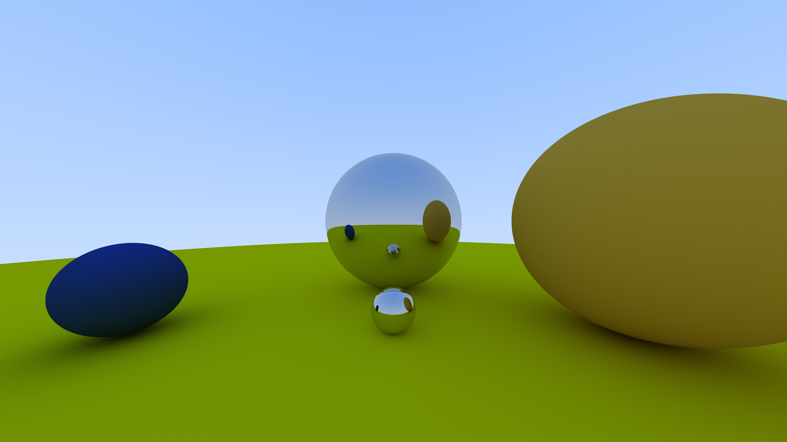

# Ray Tracer

# Implementation:
This is a large project with lots of classes, and there are many intricicies that I could discuss. My goal in this section is to give a general overview (without going too much into specific detail) of how components of the ray tracer interact to generate a final image.

I began by implementing a 3D vector class. This class was highly versatile: I used it to represent vectors, points, and colors. Colors in a digital image are typically represented using red, green, and blue (RGB) components, each ranging from 0 to 1. So a 3D vector with components in the range [0,1] could represent a color just as easily as a direction or position in space. The vector class included a variety of member functions—such as computing length and normalization—as well as numerous operator overloads to simplify expressions involving vector arithmetic.

Next, I implemented a ray class to model parametric rays in space. Each ray has an origin and a direction, and it can be evaluated at any parameter *t* to find a corresponding point along its path. To render the scene, I cast a ray through each pixel of the viewport. These rays originate from the camera's position and are traced through the scene to determine what color should be displayed at each pixel.

Next, I constructed a matter class that I used to represent different objects in the scene and an environment class that acted as a container for the matter objects. In this first version, the only form of "matter" is a sphere, so I will refer to any objects in the scene as spheres from now on. Any sphere in 3D space can be completely described by a center point and a radius. A third attribute, material, determined how rays would be reflected and attentuated upon making contact with the sphere. For example, a polished metal sphere would perfectly reflect rays that hit it, whereas a diffuse sphere would scatter and attenuate rays that hit it.

You might be wondering: if the rays originated from the camera, how could the camera "see" rays that hit objects? It seems unlikely that rays would come back towards the camera. The important distinction to make is that rays are traced *backwards*. When we shoot rays through each pixel of the viewport, we're effectively asking: what object is visible along this line of sight? If there's a sphere in front of the camera, the ray will intersect it, and we then simulate how light from the environment would reflect off that point on the sphere and ultimately reach the camera.

# Future Expansions:
There is a lot I could add to the ray tracer. Right now, the camera is locked in place at the origin. Many ray tracers have movable cameras because they're often used in video games. The camera is essentially the player, and the viewport is the player's field of view. However, I'm currently only rendering static images, so any change in perspective could be equally achieved by rendering the spheres in a different orientation. Along with a moving perspective and continuous scene, I could implement different shapes, glass objects, light-emitting objects, etc.

I rendered an 8k image and attached it to the top of this file. It took about 3 minutes to render on my Macbook Pro M2. With that being said, I didn't utilize parallel processing/ multi-threading, and I also didn't utilize my graphics card. I did the entire render on my processor. If I spent more time allocating my computer's resources properly, I could significantly improve efficiency.

# References:
[_Ray Tracing in One Weekend_](https://raytracing.github.io/books/RayTracingInOneWeekend.html)

[_The Cherno: Ray Tracing_](https://www.youtube.com/@TheCherno)